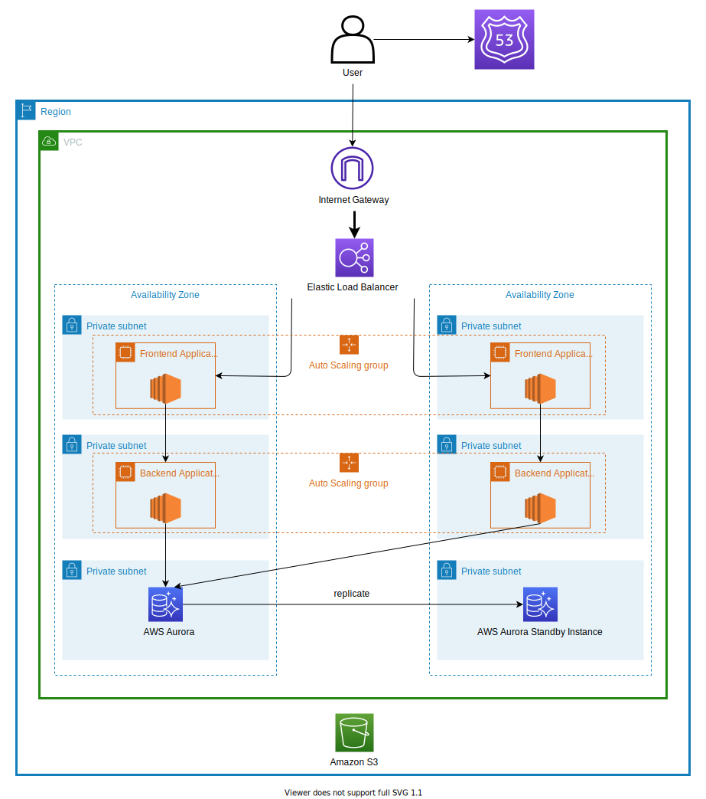

# Portfolio

## 概要

自己プロフィールやブログ、写真などを管理、投稿することができるサイト

## 仕様

以下コンテンツを含むサイト

- 自己紹介(version 1.0)
  - 名前
  - 写真
  - 経歴
  - 保有資格
  - コンタクトインフォ
  - 興味
- 写真管理(version 2.0)
- ブログ(version 3.0)

その他、随時更新予定

## アーキテクチャ

主なアーキテクチャは以下

- Frontend Application - Vue.js
- Backend Application - Java
- AuroraDB - PostgreSQL (Auroraが高い場合はEC2 Instance上にPostgreSQLをデプロイ)
- S3 (写真保存用)

## API一覧

- GET /users
- GET /users/{id}/profile

## データ項目

- Users
  - id char(36) not_null
  - first_name varchar(30) not_null
  - last_name varchar(30) not_null
  - first_name_kana varchar(30) not_null
  - last_name_kana varchar(30)
  - profile_pic_url: varchar(150)
  - introduction: varchar(500) not_null
  - email varchar(100)
  - linked_in varchar(150)
  - twitter varchar(150)
  - facebook varchar(150)
- Profiles
  - id char(36) not_null
  - user_id char(36) not_null
  - title varchar(100) not_null
  - description varchar(500)
  - started_on date
  - ended_on date
  - order integer not_null
- credentials
  - id char(36) not_null
  - user_id char(36) not_null
  - title varchar(100) not_null
  - description varchar(500)
  - issued_on date
  - expires_on date
  - badge_url varchar(150)
- interests
  - id char(36) not_null
  - category varchar(36) not_null
  - title varchar(100) not_null
  - description varchar(150) not_null
- categories
  - id char(36)
  - title varchar(100)
- assigned_interests
  - interest_id char(36) not_null
  - user_id char(36) not_null
